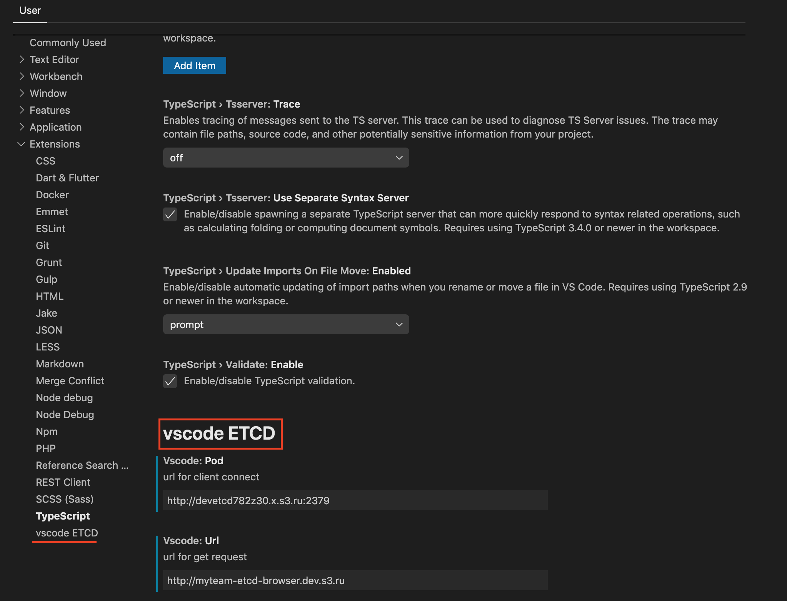

# Get Started 🚀
vscode ETCD extension allows you work faster with your etcd instance in Visual Studio Code directly.

There are following commands:  
- `Get ETCD` 
- `Update ETCD` 
- `Set ETCD Url` 
- `Set ETCD Pod` 

Before first launch you need to set up your etcd url and pod via special commands: 
 
 

You can check changes after: 
 

Now, execute the get command `Get ETCD` and enjoy😉  
  

There is [JSON Tools](https://marketplace.visualstudio.com/items?itemName=eriklynd.json-tools) helps 

## ChangeLog
See CHANGELOG [here](CHANGELOG.md)

## Feedback
Please provide feedback through the [GitHub Issue](https://github.com/pashkatrick/vscode-etcd/issues) system, or fork the repository and submit PR.
